<div align="center">
  

  <br/>

  [](https://www.python.org/)
  [](LICENSE)
  [](tests/)
  [](tests/)
  [](CHANGELOG.md)

  <br/>

  **텍스트 기반 로그라이트 추리 게임.**  
  터미널 화면에 출력된 수사 조서와 기밀 문서를 분석해 논리적 모순을 찾아내라.
</div>

---

## 스크린샷

<div align="center">

| 로비 | 전투 노드 |
|:---:|:---:|
|  |  |

| 보스 전투 | 런 기록 |
|:---:|:---:|
|  |  |

</div>

---

## 플레이 방법

```bash
pip install -r requirements.txt
python main.py
```

Python 3.11 이상 권장 (3.12 테스트 완료).

## 게임 개요

- **목표**: 8개 노드(7 일반 + 1 보스)를 클리어해 CORE를 뚫어라
- **핵심 명령어**: `analyze [키워드]` — 로그에서 발견한 모순의 핵심 단어를 입력
- **추적도(trace)**: 오답·타임아웃 시 상승. 100%에 도달하면 SYSTEM SHUTDOWN

### 주요 명령어

| 명령어 | 설명 |
|--------|------|
| `cat log` | 현재 노드 로그 출력 |
| `analyze [키워드]` | 모순 키워드 분석 공격 |
| `ls` | 현재 노드 정보 확인 |
| `skill` | 액티브 스킬 발동 (런당 1회) |
| `help` | 명령어 목록 확인 |
| `clear` | 화면 정리 |

## 시스템

### 루트 맵
각 노드 클리어 후 다음 경로(A/B)를 선택한다.

- **NORMAL**: 표준 해킹 분석
- **ELITE**: 페널티 ×1.5, 보상 ×1.5 — 클리어 시 아티팩트 선택
- **REST**: 추적도 20% 회복
- **SHOP**: 데이터 조각으로 아이템 구매
- **MYSTERY**: 이벤트 기반 선택지 (개입/무시) — 18종 이벤트

### 다이버 클래스
런 시작 전 클래스를 선택한다.

| 클래스 | 특성 | 액티브 스킬 |
|--------|------|------------|
| ANALYST | 키워드 글자 수 힌트, Hard+ 페널티 10% 감소 | 딥 스캔: 첫 두 글자 공개 |
| GHOST | REST 회복 +15%, 타임아웃 패널티 완화 | 페이드아웃: 추적도 -15% |
| CRACKER | 1초 내 속공 시 스택 축적, ELITE 아티팩트 +1 | 브루트 포스: 다음 오답 면제 |

### 아티팩트
ELITE/BOSS 클리어 시 아티팩트 1개를 선택한다. **총 28종** (COMMON / RARE / EPIC).

대표 아티팩트:
- `chrono_anchor` — 오답 시 시간 3초 복구
- `echo_cache` — 같은 오답 반복 시 페널티 누적 해제
- `pulse_barrier` — 정답 스트릭 시 시간 보너스
- `cascade_core` — 연속 정답 시 페널티 감소 누적

### Ascension (20단계)
승리할수록 더 높은 난이도가 해금된다.
- ASC 1~5: 기본 페널티 증가
- ASC 6~11: 시간 제한 단축 + 시작 추적도 20%
- ASC 12~14: ELITE 노드 확률 증가
- ASC 15~17: 상점 비용 증가, 보상 감소
- ASC 18~19: 보스 2단계
- ASC 20: 보스 3단계 + 가짜 키워드 + 명령어 제한

### MYSTERY 노드 (18종 이벤트)
터미널 신호, 고대 단말기, 데이터 경매 등 다양한 이벤트 제공. 개입 시 보상/리스크, 무시 시 안전 통과. MD5(run_seed + position)로 결정론적 배치.

### 데일리 챌린지
날짜 고정 시드로 모든 플레이어가 동일한 맵을 경험한다. 하루 1회 제한, 보상 ×1.5 배율.

### 퍼크 시스템 (13종)
캠페인 진행도로 영구 특성 해금. 시작 trace 감소, 페널티 감소, 아티팩트 슬롯 추가 등.

### 100시간 캠페인
Ascension 0~20 전부 클리어 시 `TERMINAL SILENCE` 엔딩 해금. 장기 목표.

### 엔딩 (13종)

| 엔딩 | 조건 |
|------|------|
| TERMINAL SILENCE | 100시간 캠페인 (ASC 0~20 전부) 클리어 |
| APEX PROTOCOL | Ascension 20 승리 |
| PHANTOM BREACH | 추적도 10% 이하로 승리 |
| ZERO ERROR | 오답·타임아웃 0회로 승리 |
| LAST SIGNAL | 추적도 90% 이상으로 승리 |
| SPEED DEMON | 제한 시간 대비 빠른 클리어 |
| ARTIFACT LORD | 런 1회에 아티팩트 5+ 획득 |
| PACIFIST | 스킬 미사용 클리어 |
| PERK MASTER | 퍼크 10+ 보유 상태로 클리어 |
| …외 4종 | 특수 조건 |

### 업적 (118종)
런 스타일·극한 목표·수집 기반의 다양한 업적 제공. 누적 통계 기반 자동 해금. 데일리 챌린지 연속 달성(3·7·30일) 업적 포함.

## 세이브 데이터 위치

- **Windows**: `%APPDATA%\Echoes of the Terminal\save_data.json`
- **macOS/Linux**: 실행 디렉터리의 `save_data.json`

## 파일 구성

```
main.py               — 게임 메인 루프
constants.py          — 전역 상수
progression_system.py — 세이브/퍼크/캠페인/Ascension
artifact_system.py    — 아티팩트 28종
mystery_system.py     — MYSTERY 이벤트 18종
ending_system.py      — 엔딩 13종
achievement_system.py — 업적 115종
diver_class.py        — 다이버 클래스 3종
combat_commands.py    — 전투 커맨드 핸들러
combat_timer.py       — 전투 타이머
daily_challenge.py    — 데일리 챌린지
route_map.py          — 루트 맵 분기
mutator_system.py     — 글리치 마스킹
ui_renderer.py        — Rich 기반 터미널 UI
data_loader.py        — JSON 데이터 로더
scenarios.json        — 시나리오 280개 (Pack 01-22)
packs/                — DLC 시나리오 팩 (Pack 23-27, 시나리오 23개)
boss_phase_pack.json  — ASC20 보스 페이즈 오버라이드
argos_taunts.json     — ARGOS AI 다이얼로그
```

## 개발 / 테스트

```bash
pip install -r requirements-dev.txt
PYTHONPATH=. pytest tests/ -v         # 전체 테스트 (749+ 케이스)
```

## 비주얼 에셋

| 파일 | 설명 |
|------|------|
| `assets/logo.svg` | 게임 로고타입 SVG (560×200) |
| `assets/logo_final.html` | 로고 애니메이션 프로토타입 |
| `assets/banner_preview.html` | itch.io 배너 HTML (630×500) |
| `assets/tokens.json` | 디자인 토큰 (색상·타이포·간격·효과) |
| `assets/screenshots/` | 게임 스크린샷 5장 |

## 라이선스

[MIT License](LICENSE)
